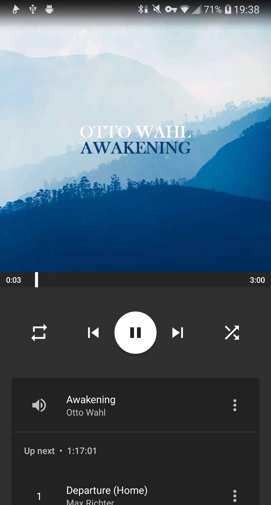
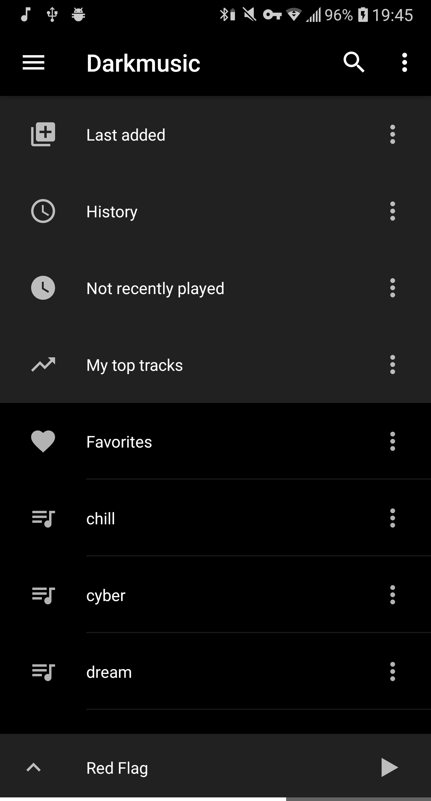
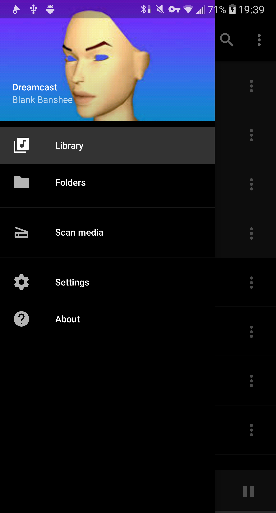
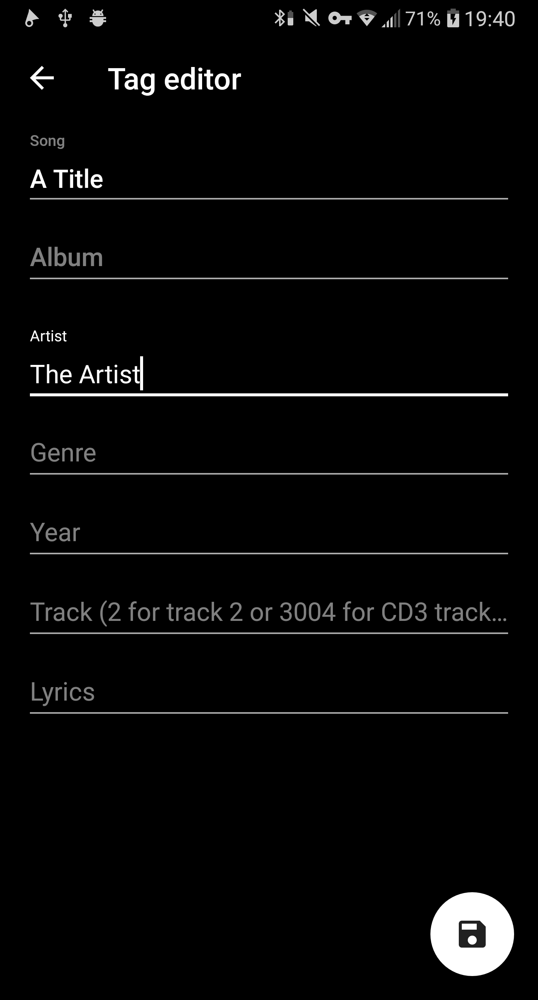

# DarkPhonograph
[](https://github.com/hyphenc/DarkPhonograph/blob/master/LICENSE.txt)

**A Phonograph fork with stylistic modifications, namely a dark player interface.**

You can find the changes I made by searching (Ctrl+Shift+F) for "// ~" in Android Studio, and see what I changed.

All of this could probably be done a lot cleaner (etc.), but it works™

## Additional Styling ##
Heads up!
I added three gradients in the file app/src/main/res/layout/fragment_player_album_cover.xml to make the notification icons visible again on white-ish covers when using the Card layout. However these will still show up on "Flat Layout", so pay attention to what version you download.

I recommend these settings: (should all be default)
```
Colors>General theme>Black (AMOLED)
Colors>Primary color>Custom>#000000 (->black)
Colors>Accent color>Custom>#FFFFFF  (->white)
```
I also recommed having just one library tab, for example "Playlists", because when you have only one library tab, the tab view will be hidden.

## Download ##
You can download the latest version [here](https://github.com/hyphenc/DarkPhonograph/releases/latest)

## Screenshots ##
   

